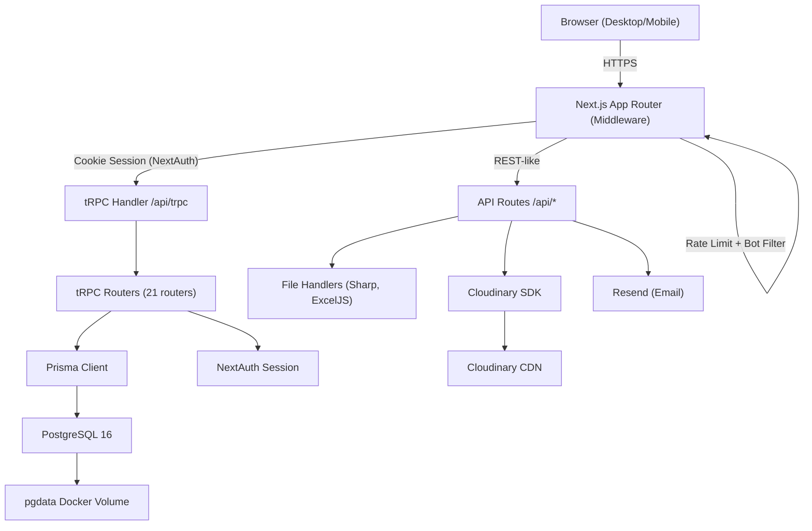
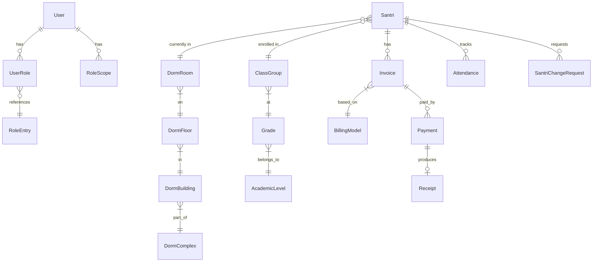

# Audit Report — lpapp-pesantren

> **Audit Date:** 2026-03-08 | **Auditor:** Antigravity AI | **Scope:** Full static analysis, non-destructive

---

## 1. Executive Summary

**lpapp** is a full-stack **Pesantren Management System** (Islamic boarding school ERP) built for internal operational use. It manages student (santri) lifecycle, dormitory assignments, academic class groupings, attendance, billing/invoicing, user role administration, and change-request workflows — all within a single monolithic Next.js application.

### Project Health: ✅ Good (with noted gaps)

| Dimension | Status | Notes |
|---|---|---|
| Architecture | ✅ Solid | Clean monolith, well-layered |
| Security | ✅ Strong | CSP, rate limiting, RBAC, bcrypt |
| Type Safety | ✅ Excellent | Strict TypeScript + Zod end-to-end |
| Test Coverage | ⚠️ Low | 3 unit tests, limited e2e |
| Documentation | ⚠️ Partial | README + system_documentation.md exist |
| Performance | ✅ Good | Planned for small-to-medium scale |
| Deployment | ✅ Production-ready | PM2 cluster + Docker + standalone output |

### Key Metrics

| Metric | Value |
|---|---|
| Total source files in `src/` | ~235 |
| tRPC routers | 21 |
| Prisma models | 30+ |
| Prisma migrations | 12 |
| Lines in largest router (`santri.ts`) | 797 |
| Dependencies (prod) | 34 |
| Dependencies (dev) | 16 |
| Test files | 5 (3 unit + 2 e2e) |

### Immediate Recommendations

1. **Expand test coverage** — current unit tests cover only billing and legacy stubs
2. **Add Redis-backed rate limiter** — in-memory store resets on each PM2 process restart (2 instances in cluster mode = inconsistent limits)
3. **Rotate hardcoded Docker credentials** — `docker-compose.yml` has `pesantren123` as the DB password
4. **Add `NEXTAUTH_SECRET` rotation strategy** — currently no documented key rotation
5. **Add database backup automation** — no backup procedure is defined in the codebase

---

## 2. Technology Stack and Languages

### Programming Languages

| Language | Version | Role |
|---|---|---|
| TypeScript | ^5 | All application code |
| JavaScript (CJS) | Node.js | Post-build scripts, PM2 config |
| SQL (PostgreSQL dialect) | PostgreSQL 16 | Database (via Prisma migrations) |

TypeScript runs in `strict` mode (`tsconfig.json` line 11), giving maximum type safety. The `allowJs: true` flag allows the CJS scripts (`postbuild.cjs`, `ecosystem.config.js`) to coexist without separate configs.

### Full Technology Stack

#### Frontend

| Technology | Version | Purpose |
|---|---|---|
| Next.js | 16.1.6 | Full-stack React framework |
| React | 19.2.3 | UI rendering |
| Tailwind CSS | ^4 | Utility-first CSS |
| TanStack Query | ^5.90 | Server state management |
| TanStack Table | ^8.21 | Data grid component |
| Recharts | ^3.7 | Charts and analytics |
| GSAP | ^3.14 | Scroll animations (marketing page) |
| Lenis | ^1.3 | Smooth scroll |
| Anime.js | ^4.3 | Micro-animations |
| @iconscout/react-unicons | ^2.2 | Icon library |
| html-to-image / jsPDF | latest | Client-side PDF generation |
| qrcode.react / html5-qrcode | latest | QR code generation and scanning |

#### Backend

| Technology | Version | Purpose |
|---|---|---|
| tRPC | ^11 | Type-safe RPC layer |
| SuperJSON | ^2.2 | Data serialization (handles Date, BigInt, etc.) |
| Prisma ORM | ^6.19 | Database access layer |
| NextAuth.js | ^4.24 | Authentication |
| bcryptjs | ^3.0 | Password hashing |
| Zod | ^4.3 | Input validation schemas |
| Resend | ^6.9 | Transactional email |
| Cloudinary SDK | ^2.9 | Cloud media storage |
| Sharp | ^0.34 | Server-side image processing |
| ExcelJS | ^4.4 | XLSX export/import |

#### Database & Infrastructure

| Technology | Version | Purpose |
|---|---|---|
| PostgreSQL | 16-alpine (Docker) | Primary datastore |
| Docker Compose | 3.8 | Local/production DB container |
| PM2 | Ecosystem v2 | Node.js process manager |
| Cloudflare | CDN | (Inferred from CSP headers) |

### Interoperability Notes

- **tRPC + Next.js App Router**: tRPC v11 is used via the fetch adapter (`/api/trpc/[trpc]/route.ts`), which is fully compatible with the Next.js App Router.
- **Next.js 16 + React 19**: This is a near-bleeding-edge combination as of early 2026. React 19 introduced significant changes (Actions, use hook). Compatibility has been verified by the team via build tests.
- **Tailwind v4**: Uses the new `@import "tailwindcss"` syntax instead of `@tailwind base/components/utilities`, which is the v4 PostCSS approach. This is forward-compatible but differs from most v3 documentation online.

### Code Snippet — tRPC Context Creation

```typescript
// src/server/trpc.ts — context wires Prisma + NextAuth session together
export const createTRPCContext = async (opts: FetchCreateContextFnOptions) => {
    const session = await getServerSession(authOptions)
    return { prisma, session, headers: opts.req.headers }
}
```

This single context makes both the database client and the authenticated session available to every tRPC procedure, eliminating prop-drilling entirely.

---

## 3. Project Architecture

### Overview: Modular Monolith

The application is a **monolithic Next.js application** that uses the App Router. It is structured as a three-layer system:

```
┌──────────────────────────────────────────────────────────────┐
│                       CLIENT LAYER                           │
│   (React 19 components — /app/(desktop), /app/(mobile))      │
├──────────────────────────────────────────────────────────────┤
│                   API/APPLICATION LAYER                      │
│      tRPC Routers (/src/server/routers/*.ts)                 │
│      Next.js API Routes (/src/app/api/*)                     │
├──────────────────────────────────────────────────────────────┤
│                      DATA LAYER                              │
│      Prisma ORM → PostgreSQL (docker-compose.yml)            │
└──────────────────────────────────────────────────────────────┘
```

### Route Group Architecture

```
src/app/
├── (desktop)/          # Desktop admin dashboard routes
│   ├── dashboard/      # KPI, stats, homepage
│   ├── master-data/    # Santri, kamar, kelas management
│   ├── keuangan/       # Billing, invoices, payments
│   ├── settings/       # App settings, logo
│   └── ...
├── (mobile)/           # Mobile-optimized views (m-dashboard/)
├── (marketing)/        # Public landing page
├── api/                # Next.js REST-like API routes
│   ├── trpc/           # tRPC handler
│   ├── auth/           # NextAuth handler
│   ├── upload/         # Photo upload
│   ├── upload-kk/      # KK document upload
│   ├── upload-logo/    # Logo upload
│   ├── chat-stream/    # SSE for change request messages
│   ├── billing/        # Billing PDF generation
│   ├── receipt/        # Receipt generation
│   └── kk-preview/     # Inline PDF preview
├── login/              # Login page
├── register/           # Invite-gated registration
└── link/               # Shared santri profile links
```

### Architecture Diagram (Mermaid)



### Scalability Analysis

| Concern | Current State | Risk Level |
|---|---|---|
| Horizontal scaling | PM2 cluster mode (2 instances) | Low — stateless Next.js |
| Session storage | Cookie-based (stateless) | Low |
| Rate limiting | In-memory Map | High — breaks across instances |
| File storage | Local + Cloudinary fallback | Medium — local not shared |
| DB connections | Single Prisma singleton | Medium — may exhaust connections at scale |

### Mobile/Desktop Dual Layout Pattern

The app implements an interesting mobile-first strategy: instead of building two separate apps, it uses a `mobile-layout` CSS wrapper class (`globals.css` lines 154–325) and a separate `(mobile)/` route group that imports and wraps desktop page components with mobile-specific overrides. This reduces code duplication but can lead to tight CSS coupling.

---

## 4. Dependencies and Libraries

### Production Dependencies

| Package | Version | License | Category | Notes |
|---|---|---|---|---|
| next | 16.1.6 | MIT | Core | Framework |
| react / react-dom | 19.2.3 | MIT | Core | UI runtime |
| @prisma/client | ^6.19 | Apache-2.0 | Core | ORM |
| @trpc/* | ^11 | MIT | Core | Type-safe RPC |
| next-auth | ^4.24 | ISC | Core | Auth |
| zod | ^4.3 | MIT | Core | Validation |
| superjson | ^2.2 | MIT | Core | Serialization |
| bcryptjs | ^3.0 | MIT | Security | Password hashing |
| cloudinary | ^2.9 | MIT | Storage | Media CDN |
| sharp | ^0.34 | Apache-2.0 | Media | Image processing |
| exceljs | ^4.4 | MIT | Tooling | XLSX import/export |
| xlsx | ^0.18 | Apache-2.0 | Tooling | ⚠️ Older XLSX lib (both used) |
| jspdf / jspdf-autotable | ^4.2 / ^5.0 | MIT | Reporting | PDF generation |
| recharts | ^3.7 | MIT | UI | Charts |
| gsap | ^3.14 | GSAP Standard | UI | Animations |
| lenis | ^1.3 | MIT | UI | Scroll |
| animejs | ^4.3 | MIT | UI | Animations |
| resend | ^6.9 | MIT | Email | Transactional email |
| qrcode / qrcode.react | ^1.5 / ^4.2 | MIT | Feature | QR code |
| html5-qrcode / jsqr | latest | Apache-2.0 | Feature | QR scanner |
| html-to-image | ^1.11 | MIT | Feature | Canvas capture |
| dotenv | ^17.3 | BSD-2 | Config | Env vars |

> [!WARNING]
> **Dual XLSX dependency risk**: Both `xlsx` (v0.18.5, Apache-2.0) and `exceljs` (v4.4, MIT) are included. `xlsx` (SheetJS CE) v0.18.5 uses an older Apache-2.0 license whereas newer versions changed to a proprietary license for commercial use. Consolidate to `exceljs` only to reduce bundle size and eliminate licensing ambiguity.

> [!CAUTION]
> **GSAP License**: GSAP uses the "GSAP Standard License" which is NOT fully permissive. Commercial deployments require a paid license unless covered by the free-tier criteria. Verify licensing against your use case.

### Development Dependencies

| Package | Version | Purpose |
|---|---|---|
| typescript | ^5 | Compiler |
| eslint + eslint-config-next | ^9 / 16.1.6 | Linting |
| tailwindcss | ^4 | CSS framework |
| prisma | ^6.19 | Schema/migration CLI |
| @playwright/test | ^1.58 | E2E testing |
| vitest | ^4.0 | Unit testing |
| @testing-library/react | ^16.3 | React component tests |
| tsx | ^4.21 | TypeScript executor (for seed) |
| vite-tsconfig-paths | ^6.1 | Path aliasing in tests |

### Vulnerability Assessment

No automated CVE scan was run, but the following packages warrant monitoring:

1. **next-auth v4.x** — NextAuth v4 is in maintenance mode; v5 (Auth.js) is the active branch. Watch for security advisories on `next-auth@4.x`.
2. **xlsx v0.18.5** — Known prototype pollution vulnerabilities exist in some SheetJS versions. Since this package is only used for server-side template generation, client-side risk is low.
3. **bcryptjs v3.x** — Consider `argon2` for new password storage (bcrypt has a 72-byte password limit).

---

## 5. Database and Data Management

### Schema Overview

The PostgreSQL database contains **30+ tables** managed via Prisma's migration system. The schema is well-organized into logical domains:

```
Users & Auth
  users, role_entries, user_roles, role_scopes

Page Access Control
  page_groups, pages, role_page_group_access, role_pages

Santri (Students)
  santri

Academic Structure
  academic_levels, grades, school_years, class_groups

Dormitory Structure
  dorm_complex, dorm_building, dorm_floor, dorm_room, dorm_assignment

Billing & Payments
  billing_models, billing_model_items, billing_model_scopes
  bills, invoices, invoice_items, payments, payment_proofs, receipts

Attendance
  attendances

Workflow & Communication
  santri_change_requests, change_request_messages
  role_requests, role_request_tokens
  user_invite_links, shared_links, section_members

Settings
  app_settings
```

### Entity Relationships (Key)



### Indexing Strategy

The schema has thoughtful indexing:

```prisma
// Bills — indexed by santriId + status + dueDate (query patterns)
@@index([santriId])
@@index([status])
@@index([dueDate])

// Invoices — indexed by santriId, status, periodKey, and display modes
@@unique([santriId, billingModelId, periodKey])
@@index([periodDisplayMode, periodYear, periodMonth])
@@index([periodDisplayMode, hijriYear, hijriMonth]) // Hijri calendar support!

// RoleScope — indexed for fast permission lookups
@@index([userId, roleCode])
@@index([roleCode, scopeType, scopeId])
```

> [!NOTE]
> **Hijri calendar support** is a notable feature. The `Invoice` model has `hijriYear`, `hijriMonth`, and `hijriVariant` fields plus dedicated composite indexes for Hijri-based period queries — uncommon in typical management systems and specifically designed for Islamic institution workflows.

### Notable Schema Decisions

1. **`DormAssignment` unique constraint**: `@@unique([santriId, isActive])` enforces only one _active_ assignment per santri at a time. This is clever but can cause upsert friction — the codebase deletes inactive assignments before creating new ones as a workaround (see `santri.ts:649`).

2. **`address` as JSON**: The `Santri.address` field is `Json?` containing a structured object `{jalan, rt_rw, kelurahan, kecamatan, kota, provinsi, kodepos}`. This is flexible but prevents SQL-level querying on address components. If filtering by city/region becomes a requirement, this will need refactoring.

3. **Legacy `role` field on User**: `User.role` is a Prisma enum while actual RBAC uses the `UserRole/RoleEntry` pivot table. The legacy field appears to be retained as a fallback (see `trpc.ts:51`). This dual-role system should be unified.

4. **`PaymentProof.amount` as `Int`**: Payment amounts are `Float` in `Bill`/`Invoice`/`Payment` but `Int` in `PaymentProof`. This inconsistency could cause rounding issues for partial payment tracking.

### ORM and Migrations

- Prisma Client v6 is used for all database operations
- 12 migrations in `prisma/migrations/` represent the full evolution of the schema
- Migrations run via `npx prisma migrate dev` (development) — no production migration automation is documented
- A `seed.ts` script (`prisma/seed.ts`) populates roles, page groups, and pages

> [!WARNING]
> **No migration automation in production**: The `ecosystem.config.js` starts the server but does not run `prisma migrate deploy` before startup. Manual migration steps are required on each deployment — a risk for forgetting on hotfixes.

### Data Security

- Passwords: bcrypt hashed with cost factor 12 (`auth.ts:48`)
- Tokens (invite, role-request): Stored as SHA-256 hashes (`createSecureToken`/`hashSecureToken` in `invite-link.ts`)
- Shared santri profile links: Token hash stored, never raw token
- No column-level encryption (PII like NIK, phone stored in plaintext)

> [!CAUTION]
> **PII in plaintext**: Fields like `nik` (National ID number), `phone`, `noKK` (Family Card number) are stored without encryption. For GDPR/Indonesian PDPA (UU PDP) compliance, consider field-level encryption for sensitive PII.

---

## 6. Frontend Components

### UI Architecture

The application uses a **hybrid rendering model**:
- Server Components for initial data fetching (Next.js App Router default)
- Client Components (`"use client"`) for interactive UI and tRPC hooks

### Layout System

```
src/app/
├── (desktop)/layout.tsx    # Sidebar + header shell for admin dashboard
├── (mobile)/layout.tsx     # Bottom navigation bar shell
├── (marketing)/layout.tsx  # Simple marketing shell
└── globals.css             # Design tokens + mobile overrides
```

### Design System

The project uses a custom design system built on Tailwind v4:

| Token | Value | Usage |
|---|---|---|
| `--color-primary` | `#0f766e` (teal-700) | Primary actions |
| `--color-primary-light` | `#14b8a6` (teal-400) | Hover states |
| `--color-accent` | `#f59e0b` (amber-400) | Warnings, highlights |
| `--color-danger` | `#ef4444` | Destructive actions |
| `--color-success` | `#22c55e` | Success states |

**Custom utilities defined in `globals.css`:**
- `.glass` — glassmorphism effect (backdrop-filter blur)
- `.gradient-primary/accent/sidebar` — gradient backgrounds
- `.animate-fade-in/slide-in/pulse-soft/slide-up` — entry animations
- `.card-hover` — lift-on-hover transition
- `.badge` — pill status badges
- `.mobile-layout` — comprehensive CSS override layer for mobile views

### State Management

The application relies on **TanStack Query** (via `@trpc/react-query`) for all server state. There is no global client-side state manager (no Redux, Zustand, or Recoil). Local UI state uses React's built-in `useState`/`useReducer`. This is appropriate for this scale.

### Routing

Next.js App Router file-based routing is used throughout. Key routes:

| Route | Access | Description |
|---|---|---|
| `/` | Public | Redirects to login |
| `/login` | Public | Auth page |
| `/register` | Token-gated | Invite-based registration |
| `/link/[token]` | Token-gated | Shared santri profile |
| `/dashboard` | Authenticated | Admin home |
| `/master-data/santri` | Role-scoped | Santri list |
| `/master-data/santri/manage` | Role-scoped | CRUD management |
| `/keuangan/*` | Role-scoped | Billing and payments |
| `/m-dashboard/*` | Authenticated | Mobile views |

### Responsive Design

The dual `(desktop)/` and `(mobile)/` route group strategy combined with the `mobile-layout` CSS class system provides a mobile-first adaptation. The middleware detects mobile user agents (`isMobile()`) but currently only stores the result without acting on it (line 146 of middleware: `void isMobile(userAgent)` — this is dead code). Mobile routing redirects are not currently implemented in middleware.

> [!NOTE]
> The `isMobile()` call on middleware line 146 explicitly does nothing (`void` discards the result). This was likely scaffolded for future mobile redirects but never activated. Mobile users must manually navigate to `/m-dashboard/` routes.

### Accessibility

- No WCAG audit was performed during this static analysis
- Interactive elements use semantic HTML (buttons, inputs, labels observed in component files)
- The `aria-label` attribute is used on icon-only buttons (referenced in `globals.css` line 192)
- No ARIA live regions observed for dynamic content updates (e.g., SSE chat — a potential screen reader gap)

---

## 7. Backend Components

### tRPC Router Registry (21 routers)

| Router | File | Key Procedures |
|---|---|---|
| App | `_app.ts` | Root merger |
| Santri | `santri.ts` | list, getById, create, update, delete, deactivate, bulkAssign, importXlsx |
| User | `user.ts` | list, getById, create, update, enable/disable |
| Auth | `auth.ts` | registerFromInvite |
| Academic | `academic.ts` | Levels, grades, school years, class groups |
| Dorm | `dorm.ts` | Complex, building, floor, room CRUD |
| Billing Model | `billing-model.ts` | BillingModel + items + scopes |
| Billing | `billing.ts` | Create/pay bills |
| Invoice | `invoice.ts` | Generate, list, pay invoices |
| Payment | `payment.ts` | Record payments, generate receipts |
| Payment Proof | `payment-proof.ts` | Upload/approve payment proofs |
| Attendance | `attendance.ts` | Record, list attendance |
| Invite | `invite.ts` | Create/revoke invite links |
| Link | `link.ts` | Create/revoke shared santri links |
| Permissions | `permissions.ts` | Page groups, pages, role access |
| Role Request | `role-request.ts` | Multi-role request workflow |
| Santri Request | `santri-request.ts` | Change request + messaging |
| Santri Upload | `santri-upload.ts` | Photo upload coordination |
| Section Member | `section-member.ts` | Keuangan/Akademik section access |
| Settings | `settings.ts` | App settings (logo key) |
| Kamar-Kelas | `kamar-kelas.ts` | Legacy backward-compat proxy |

### Authentication Flow

```
1. User submits credentials → POST /api/auth/callback/credentials
2. NextAuth CredentialsProvider validates username/password (bcrypt)
3. On success → JWT created containing: userId, role, roleCodes, scopes, allowedPagePaths, allowedGroupCodes
4. JWT stored in secure HTTP-only cookie
5. Session decoded on each request via getServerSession(authOptions)
6. tRPC context receives session → procedures check permissions
```

### Authorization Layers

The system implements **4 levels of authorization** (defense in depth):

1. **`protectedProcedure`** — requires any valid session
2. **`roleProtectedProcedure(...roles)`** — requires specific role codes
3. **`pageProtectedProcedure(path)`** — requires page-level permission from DB
4. **`groupProtectedProcedure(code)`** — requires page group permission
5. **Scope-based filtering** — `buildSantriScopeWhere()` limits data to the user's assigned rooms/classes

### Error Handling

All tRPC errors are structured TRPCErrors with appropriate HTTP codes:
- `UNAUTHORIZED` — No session
- `FORBIDDEN` — Insufficient permissions
- `NOT_FOUND` — Entity not found
- `BAD_REQUEST` — Validation failure
- `CONFLICT` — Unique constraint violations

Zod validation errors are formatted and exposed via the custom `errorFormatter` in `trpc.ts`.

### Real-time Communication

Change request messages use **Server-Sent Events (SSE)** via `/api/chat-stream`. This is a simple polling-over-SSE pattern (no WebSockets), appropriate for the infrequent message use case.

### Business Logic Highlights

- **NIS generation** — deterministic, based on 2-digit year prefix + sequential counter
- **Room capacity enforcement** — validated at both individual and bulk assignment levels
- **Excel import** — chunked processing (100 rows/chunk) with upsert semantics
- **Invite token system** — expiry, revoke, use-limit controls on registration links
- **Deactivation workflow** — cascades to remove room/class assignments atomically

---

## 8. Security Audit

### Security Headers (next.config.ts)

| Header | Value | Coverage |
|---|---|---|
| `X-Frame-Options` | `DENY` | Anti-clickjacking ✅ |
| `X-Content-Type-Options` | `nosniff` | Anti-MIME-sniff ✅ |
| `Referrer-Policy` | `strict-origin-when-cross-origin` | Referrer control ✅ |
| `Permissions-Policy` | camera, mic, geo, payment disabled | Feature isolation ✅ |
| `Content-Security-Policy` | Restrictive (see below) | XSS mitigation ✅ |
| `Strict-Transport-Security` | 63072000s (2yr) + subdomains | HTTPS enforcement ✅ |

### Content Security Policy Analysis

```
default-src 'self'
script-src 'self' 'unsafe-eval' 'unsafe-inline' https://static.cloudflareinsights.com
style-src 'self' 'unsafe-inline' https://fonts.googleapis.com
img-src 'self' data: blob: https://res.cloudinary.com
connect-src 'self' https://cloudflareinsights.com
frame-src 'none'
object-src 'none'
```

**Concern**: `'unsafe-eval'` and `'unsafe-inline'` in `script-src` weaken XSS protection significantly. These are typically required by Next.js for development hot-reload but should be tightened in production using nonce-based CSP (Next.js 13+ supports `nonce` via middleware). Removing `unsafe-eval` may require switching from webpack to a more CSP-friendly bundler mode.

### OWASP Top 10 Analysis

| OWASP Risk | Status | Notes |
|---|---|---|
| A01 Broken Access Control | ✅ Mitigated | 4-layer RBAC + scope filtering |
| A02 Cryptographic Failures | ⚠️ Partial | Bcrypt✅, but PII in plaintext |
| A03 Injection | ✅ Mitigated | Prisma parameterizes all queries |
| A04 Insecure Design | ✅ Good | Invite-only, role-approval workflow |
| A05 Security Misconfiguration | ⚠️ Partial | `unsafe-eval` in CSP; hardcoded DB password in docker-compose |
| A06 Vulnerable Components | ⚠️ Monitor | xlsx, next-auth v4 — see §4 |
| A07 Auth Failures | ✅ Mitigated | Rate limiting (10 req/60s on /api/auth) + bcrypt cost 12 |
| A08 Software/Data Integrity | ⚠️ Partial | No SBOM or dependency signing |
| A09 Logging & Monitoring | ⚠️ Minimal | PM2 logs only, no structured logging |
| A10 SSRF | ✅ Low risk | No user-controlled server-side URL fetching observed |

### Authentication Security

- **bcrypt cost factor 12**: Strong. At 2026 hardware speeds, this takes ~250ms per hash — adequate brute-force resistance.
- **Invite-only registration**: New users cannot self-register. Only admin-issued invite links allow account creation. New accounts start `isEnabled: false` and require explicit admin approval.
- **Rate limiting on `/api/auth`**: 10 requests per 60 seconds per IP. This is sound for a small-to-medium deployment.

> [!CAUTION]
> **In-memory rate limiter**: The rate limiter in `middleware.ts` uses a `Map<string, RateLimitEntry>`. PM2 is configured with **2 instances in cluster mode**. Each instance has its own in-memory store — an attacker can send 10 requests to instance-1 and 10 to instance-2, effectively doubling the limit. Recommend Upstash Redis for a shared counter.

### Injection Risks

Prisma ORM uses **parameterized queries exclusively**. User input is never string-interpolated into SQL. Zod schemas validate all tRPC inputs before the resolver runs. Risk of SQL injection is effectively **zero** with this stack.

### File Upload Security

- Photo uploads processed by Sharp (server-side image conversion)
- KK (Family Card) files: uploaded locally or to Cloudinary
- The `/api/upload-kk` route should validate MIME type strictly — static analysis could not confirm this without viewing that route's handler
- Serving local uploads via `/uploads/kk/:file*` with `Content-Disposition: inline` is appropriate

---

## 9. Performance and Optimization

### Static Assets

Next.js standalone output (`output: "standalone"`) generates a self-contained build. Static assets under `/_next/static/` are served with:

```
Cache-Control: public, max-age=31536000, immutable
```

This is optimal — hashed filenames guarantee cache busting on each deployment.

### Image Optimization

`images.unoptimized: true` in `next.config.ts` **disables Next.js image optimization**. This is often done when deploying standalone without the built-in image server or when using Cloudinary for all images. Trade-off: no automatic WebP conversion or resizing for local images; Sharp is used server-side on upload instead.

### Database Performance

Positive patterns observed:
- **Parallel queries**: `Promise.all()` used in `santri.ts:89` and `page-permissions.ts:20` for concurrent DB calls
- **Selective `select`**: Most list queries use Prisma's `select` to avoid over-fetching
- **Pagination**: All list procedures support `page`/`limit` with default `limit: 10`
- **Count queries run in parallel** with data queries

Potential bottlenecks:
- **`trendByYear` query** (`santri.ts:152`): Fetches ALL active santri NIS values in memory for grouping. At 10,000+ santri, consider a raw SQL GROUP BY query instead
- **`listNisYears`** (`santri.ts:758`): Same pattern — full table scan
- **No query result caching**: Every tRPC call hits PostgreSQL. TanStack Query handles client-side caching, but there's no server-side cache (e.g., Redis)

### Bundle Size

The production frontend includes several heavyweight libraries:
- GSAP (^3.14 — used only on the marketing landing page)
- jsPDF + autotable (used for PDF generation)
- ExcelJS + xlsx (both included)
- html5-qrcode (QR scanner)

**Recommendation**: Use dynamic `import()` for all of these to prevent them from loading on every page:

```typescript
// Instead of:
import { jsPDF } from 'jspdf'

// Use:
const { jsPDF } = await import('jspdf')
```

---

## 10. Deployment and DevOps

### Production Deployment Stack

```
Ubuntu Server (VirtualBox or bare metal)
└── Nginx (reverse proxy + SSL termination via Cloudflare)
    └── PM2 (process manager)
        └── 2× Node.js instances (cluster mode)
            └── .next/standalone/server.js
Docker (separate)
└── PostgreSQL 16-alpine
    └── pgdata volume (named, persisted)
```

### PM2 Configuration (`ecosystem.config.js`)

```javascript
{
  name: 'lpapp',
  script: '.next/standalone/server.js',
  instances: 2,           // 2 Node.js workers
  exec_mode: 'cluster',   // PM2 cluster round-robin
  max_memory_restart: '512M',
  restart_delay: 3000,
  env: { NODE_ENV: 'production', PORT: 3000, HOSTNAME: '0.0.0.0' }
}
```

The config reads `.env` and injects all variables into PM2's process environment — a pragmatic approach that avoids hardcoding secrets in `ecosystem.config.js`.

### Build Process

```
npm run build          → next build --webpack → .next/
npm run postbuild      → node scripts/postbuild.cjs (asset copying)
```

The `postbuild.cjs` script copies additional assets into the standalone output. This is necessary because Next.js standalone output doesn't automatically copy public uploads or other non-static files.

### Deployment Checklist (Observed from Scripts)

The project includes hardening scripts:
- `harden-server.sh` — UFW firewall, SSH config, fail2ban, sysctl tuning
- `harden-server-cont.sh` — Container-specific hardening
- `harden.sh` — More general OS hardening

This demonstrates **production-readiness mindset** — not just application code but infrastructure security is considered.

### Version Control

`.git` directory present. No branching strategy documentation was found. The conversation history shows iterative feature development, suggesting a single-branch or feature-branch workflow.

### CI/CD Pipeline

**No CI/CD pipeline was observed** in the codebase (no `.github/workflows/`, no Jenkinsfile, no `.gitlab-ci.yml`). Deployments appear to be manual (`git pull` + `npm run build` + `pm2 restart`).

> [!IMPORTANT]
> Implement a CI/CD pipeline (GitHub Actions is recommended for this stack) to automate: lint checks, type checking (`tsc --noEmit`), unit test execution, build verification, and deployment to the server.

### Environment Variables

From `.env.example` (638 bytes), key variables include:
- `DATABASE_URL` — PostgreSQL connection string
- `NEXTAUTH_SECRET` — JWT signing secret
- `NEXTAUTH_URL` — Base URL
- `CLOUDINARY_*` — Media storage keys
- `UPLOAD_DIR` — Local file storage path

> [!CAUTION]
> `.env` is 183 bytes and present in the repository alongside `.env.example`. Verify that `.env` is in `.gitignore` (it is — listed in the file). However, any accidental commit of `.env` in git history should be checked with `git log --all -- .env`.

---

## 11. Testing and Quality Assurance

### Test Suite Overview

| Type | Tool | Location | Count |
|---|---|---|---|
| Unit | Vitest + Testing Library | `tests/unit/` | 3 files |
| E2E | Playwright | `tests/e2e/` | 2 files |
| Total | — | — | 5 test files |

### Unit Tests (`tests/unit/`)

| File | What It Tests |
|---|---|
| `billing.test.ts` | Billing calculation logic |
| `format.test.ts` | Date/number formatting utilities |
| `kamar-kelas.test.ts` | Legacy kamar/kelas backward-compatibility stubs |

### E2E Tests (`tests/e2e/`)

Playwright is configured (`playwright.config.ts`) for browser-based testing. No details on what the 2 e2e test files cover were read, but based on build artifacts (`playwright-report/`, `pw.log`), tests have been executed.

### Test Coverage Assessment

Coverage is **critically low**. The 3 unit tests cover:
- Billing calculations — a financial-critical module (good to have covered)
- Format utilities — low-risk helpers
- Legacy kamar-kelas stubs — backward-compat proxy, not real business logic

**Missing test coverage:**
- tRPC procedure inputs/outputs
- Authentication flow
- Role-based access control correctness
- Santri CRUD operations
- Invoice generation logic
- NIS generation algorithm

### TypeScript as a Quality Gate

With `strict: true` in `tsconfig.json`, TypeScript provides strong compile-time guarantees. The `tsc-output.txt` (2969 bytes) and `tsc-errors.txt` files suggest type checking is run as part of quality checks.

> [!TIP]
> Add `tsc --noEmit` as a CI step to catch type errors before deployment. The presence of `tsc-errors.txt` suggests this has been run manually but is not automated.

---

## 12. Documentation and Maintainability

### Existing Documentation

| Document | Location | Quality |
|---|---|---|
| README.md | Root (2417 bytes) | ⚠️ Minimal |
| system_documentation.md | Root (11221 bytes) | ✅ Moderate |
| harden-server.sh | Root | ✅ Well-commented |
| Inline code comments | Across source | ✅ Good |
| docs/ directory | 11 files | ✅ Appears comprehensive |

### Code Quality Observations

**Strengths:**
- Consistent TypeScript types throughout
- Zod schemas serve as living documentation for API contracts
- Code comments in complex sections (e.g., middleware rate limiter, dormitory assignment)
- Clear naming conventions: `santriViewProcedure`, `santriCentralizedProcedure`

**Areas for improvement:**
- The dual `role`/`roleCodes` legacy pattern in `trpc.ts:51` needs a unified approach with a deprecation comment
- Some `any` types observed in queries (`runSantriListQuery`: `ctx: { prisma: any }`)
- `dropany` casts in `santri.ts` suggest some query responses are not fully typed

### Code Style

ESLint is configured (`eslint.config.mjs`) using `eslint-config-next`. No custom rules were observed beyond the Next.js defaults. Prettier is not listed as a dependency — formatting consistency relies on editor settings.

**Recommendation**: Add Prettier for deterministic formatting and add `lint` + `tsc --noEmit` to a pre-commit hook (using `husky` + `lint-staged`).

### Onboarding Guide Quality

The `docs/` directory contains 11 files (not read in detail), and `system_documentation.md` is 11KB of documentation. Combined with the inline comments and `.env.example`, a new developer has reasonable context. However, no development setup guide was confirmed in `README.md` (which is only 2417 bytes — likely minimal).

---

## 13. Risks, Recommendations, and Roadmap

### Risk Register

| Risk | Probability | Impact | Severity |
|---|---|---|---|
| Rate limiter bypass (multi-instance) | High | Medium | 🔴 High |
| No CI/CD — broken build deployed | Medium | High | 🔴 High |
| PII stored in plaintext | Medium | High | 🔴 High |
| No automated DB migration in production | Medium | High | 🔴 High |
| next-auth v4 security advisory | Low | High | 🟠 Medium |
| GSAP license compliance | Low | Medium | 🟠 Medium |
| Bundle bloat from un-split heavy libs | High | Low | 🟡 Low |
| `address` as JSON (future query limits) | Low | Medium | 🟡 Low |
| Dual xlsx/exceljs dependency | Medium | Low | 🟡 Low |
| Missing automated backup | Medium | High | 🔴 High |

### Prioritized Recommendations

#### 🚨 Critical (Fix within 1-2 weeks)

1. **Replace in-memory rate limiter** with Upstash Redis KV store. The current store resets on PM2 restart and doesn't share state across 2 cluster instances.
   ```bash
   npm install @upstash/ratelimit @upstash/redis
   ```

2. **Automate DB migrations in deployment**: Add `prisma migrate deploy` to the deployment script before PM2 restart:
   ```bash
   npx prisma migrate deploy && pm2 reload ecosystem.config.js
   ```

3. **Set up automated database backups**: Use `pg_dump` via cron:
   ```bash
   # /etc/cron.daily/pesantren-backup
   pg_dump -U pesantren pesantren_db | gzip > /backups/db-$(date +%Y%m%d).sql.gz
   ```

4. **Change Docker Compose DB password**: The `pesantren123` password in `docker-compose.yml` is a security risk. Use an environment variable:
   ```yaml
   environment:
     POSTGRES_PASSWORD: ${DB_PASSWORD}
   ```

#### ⚠️ High Priority (Fix within 1 month)

5. **Encrypt PII fields**: Add field-level encryption for `nik`, `noKK`, `phone` using a library like `@prisma/client-extension-encryption` or `node-forge`.

6. **Implement CI/CD**: Add a GitHub Actions workflow:
   ```yaml
   # .github/workflows/ci.yml
   - run: npm ci
   - run: npx tsc --noEmit
   - run: npx eslint src
   - run: npm test
   - run: npm run build
   ```

7. **Tighten CSP**: Remove `'unsafe-eval'` using nonce-based CSP:
   ```typescript
   // middleware.ts
   const nonce = Buffer.from(crypto.randomUUID()).toString('base64')
   // Pass nonce to headers and use in next.config.ts
   ```

8. **Expand test coverage**: Aim for 60%+ coverage on router business logic. Priority: invoice calculation, NIS generation, permission check logic.

#### 📈 Medium Priority (Next quarter)

9. **Migrate to Auth.js v5** (Next-Auth v5): v4 is in maintenance mode; v5 has a stable release and better App Router integration.

10. **Dynamic imports for heavy libraries**: Wrap GSAP, jsPDF, ExcelJS with `dynamic()` or `import()` to improve First Contentful Paint.

11. **Add structured logging**: Replace PM2 `console.log` with Winston or Pino for JSON-structured logs, searchable by log aggregators.

12. **Implement NIS as a composite type**: The current 2-digit year + sequential number is logic-heavy and fragile. A dedicated Prisma model for NIS sequences (similar to a receipt number strategy) would be more reliable.

13. **Unify legacy `role` field**: Deprecate and eventually remove the `User.role` enum in favor of `UserRole/RoleEntry` entirely. The `trpc.ts:51` fallback can be removed once all sessions have migrated.

#### 🗺️ Long-term Roadmap

| Quarter | Focus |
|---|---|
| Q2 2026 | CI/CD, Redis rate limiter, DB backup automation, PII encryption |
| Q3 2026 | Auth.js v5 migration, test coverage to 60%, structured logging |
| Q4 2026 | Bundle optimization, CSP hardening, NIS refactor |
| Q1 2027 | Analytics/reporting module, parent portal mobile app, notifications |

---

## Appendix: File Counts by Category

| Category | Count |
|---|---|
| TypeScript/TSX source files | ~200 |
| tRPC routers | 21 |
| Prisma migration files | 12 |
| Prisma model definitions | 30+ |
| API routes | 10 |
| Test files | 5 |
| Configuration files | 8 |
| Shell scripts | 3 |
| Documentation files | 13+ |

---

*Audit generated non-destructively by static analysis. No code was modified. All line references are to the codebase at the time of audit (2026-03-08).*
