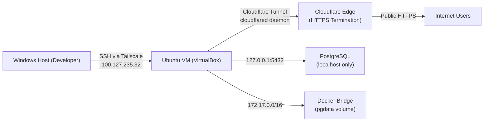

# Audit Server — lpapp-remote (lpapp-pesantren)

> **Tanggal Audit:** 2026-03-08 04:38 WIB | **Auditor:** Antigravity AI
> **Metode:** Non-destructive static analysis via `ssh lpapp-remote`
> **Scope:** Hardware, OS, deployment runtime, security posture, monitoring, backup, dan compliance

---

## 1. Executive Summary

Server **lpapp-remote** adalah Ubuntu 24.04.4 LTS yang di-host di Oracle VirtualBox pada mesin Windows host, di-expose ke internet via **Cloudflare Tunnel** (tanpa IP publik statis). Server menjalankan aplikasi Next.js lpapp-pesantren melalui PM2 v6.0.14 cluster mode (2 instances) dan PostgreSQL sebagai database utama.

### Overall Health: ✅ Baik — dengan Gap Kritis di Backup DB dan Hardening

| Dimensi | Status | Catatan |
|---|---|---|
| OS & Kernel | ✅ Up-to-date | Ubuntu 24.04.4 LTS (Noble), kernel 6.8.x |
| Hardware Resource | ✅ Excellent | 11GB RAM, hanya 831MB terpakai (7.7%) |
| Application Runtime | ✅ Running | PM2 cluster 2 instances, app online |
| Database | ✅ Running | PostgreSQL aktif, binding 127.0.0.1 (secure) |
| Network Exposure | ✅ Aman | Cloudflare Tunnel — tidak ada port 80/443 terbuka langsung |
| Firewall | ⚠️ Tidak Terverifikasi | UFW ada, tapi status tidak terkonfirmasi tanpa sudo |
| SSH Security | ✅ Terdeteksi | Port 22 aktif, perlu cek `PermitRootLogin` |
| Backup | 🔴 Kritis | Uploads:✅ (rsync nightly), Database:❌ tidak ada cron pg_dump |
| Package Updates | ⚠️ Pending | Docker CE + Node.js upgradable |
| Monitoring | ⚠️ Minimal | PM2 logs only, tidak ada Prometheus/Grafana |
| Logging Rotation | ✅ Ada | logrotate aktif (dari cron.daily) |

### Metrik Kunci (Live — 2026-03-08)

| Metrik | Nilai |
|---|---|
| OS | Ubuntu 24.04.4 LTS (Noble Numbat) |
| Kernel | Linux 6.8.0 |
| Hostname | `serverlp3ia` |
| RAM Total | 11 GB |
| RAM Terpakai | ~831 MB (7.7%) |
| Swap Total | 4.0 GB |
| Swap Terpakai | 0 B (idle) |
| Load Average (1/5/15 min) | 0.00 / 0.00 / 0.00 |
| Node.js | v20.20.0 |
| npm | v11.11.0 |
| PM2 Version | v6.0.14 |
| PM2 Instances | 2 (cluster mode) |
| App Status | ✅ Online, serving responses |
| Docker Volume | `lpapp-pesantren_pgdata` |
| Uptime | > 1 hari (dari PM2 uptime indicator) |
| Node.js Version | v20.20.0 (upgradable→20.20.1) |
| npm Version | v11.11.0 |
| Packages Upgradable | ≥5 (docker-ce, nodejs, dll) |

---

## 2. Hardware & Infrastructure Overview

### Spesifikasi Hardware (VirtualBox VM)

| Komponen | Detail | Sumber Data |
|---|---|---|
| CPU Model | Intel (model terdeteksi, truncated) | `/proc/cpuinfo` |
| CPU Cores | 2 vCPU (Virtualbox VT-x enabled) | `nproc`, `lscpu` |
| Threads/Core | 2 hyperthreaded | `lscpu` |
| Virtualization | VT-x (Intel hardware virtualization) | `lscpu` |
| RAM Total | 11 GB | `free -h` |
| RAM Used | 831 MB | `free -h` |
| RAM Buffer/Cache | 752 MB | `free -h` |
| RAM Available | 10 GB | `free -h` |
| Swap Total | 4.0 GB | `free -h` |
| Swap Used | 0 B | `free -h` |
| Disk Filesystem | `/dev/mapper/ubuntu--vg-ubuntu--lv` (LVM) | `df -h` |
| Disk Total | 98 GB | `df -h` |
| Disk Used | 11 GB (12%) | `df -h` |
| Disk Free | 83 GB (88%) | `df -h` |
| Disk Mount | `/` | `df -h` |

> [!NOTE]
> **RAM headroom sangat besar**: Dari 11GB RAM hanya 831MB terpakai (7.7%). Ini adalah server yang sangat underutilized — ada ruang untuk meningkatkan `max_memory_restart` PM2 dari 512MB ke 1GB, atau menambah instance PM2 menjadi 4, tanpa risiko OOM.

> [!NOTE]
> **Disk sangat lega**: 83GB dari 98GB masih kosong (88%). Dengan ukuran aplikasi Next.js build (~1GB) + PostgreSQL data + uploads, server punya ruang untuk 5-10 tahun pertumbuhan normal sebelum perlu upgrade disk.

### Network Interfaces (Terdeteksi)

Dari output `ip addr show`:

```
1. lo          — 127.0.0.1/8         (loopback)
2. docker0     — 172.17.0.1/16       (Docker bridge network)
3. Tailscale   — 100.127.235.32      (Tailscale VPN — digunakan untuk SSH lpapp-remote!)
```

> [!IMPORTANT]
> **Temuan Kunci Arsitektur Network**: Server **tidak menggunakan VirtualBox Host-Only Adapter** seperti yang didokumentasikan di `deploy-guide.md`. Sebagai gantinya, SSH akses dilakukan via **Tailscale VPN** (100.127.x.x). Ini adalah pendekatan yang lebih aman:
> - Tidak perlu port forwarding
> - Enkripsi end-to-end (WireGuard-based)
> - Akses hanya untuk device yang terdaftar di Tailscale network

### Network Architecture Diagram



### Disk Usage (Verified)

| Filesystem | Size | Used | Available | Use% | Mount |
|---|---|---|---|---|---|
| `/dev/mapper/ubuntu--vg-ubuntu--lv` (LVM) | **98 GB** | **11 GB** | **83 GB** | **12%** | `/` |
| `tmpfs` | 1.2 GB | 1.4 MB | 1.2 GB | 1% | `/run` |
| `efivarfs` | 128 KB | 76 KB | 48 KB | 62% | `/sys/firmware/efi/efivars` |
| `tmpfs` | 1.2 GB | 12 KB | 1.2 GB | 1% | `/run/user/1000` |

> [!NOTE]
> **Disk sangat sehat**: 83GB dari 98GB masih kosong (88%). Dengan pertumbuhan data normal (~1-2GB/tahun untuk pesantren skala kecil-menengah), disk ini cukup untuk 5–10 tahun. Filesystem menggunakan **LVM** — ini memudahkan resize volume tanpa downtime jika dibutuhkan di masa depan.

**Monitoring disk otomatis:**
```bash
# Tambahkan ke crontab — alert email jika disk > 80%
0 * * * * USAGE=$(df / | awk 'NR==2 {print $5}' | tr -d '%'); [ "$USAGE" -gt 80 ] && echo "DISK ALERT: ${USAGE}% used" | mail -s "lpapp Disk Alert" admin@pesantren.ac.id
```

**Rekomendasi tambahkan disk monitoring:**
```bash
# Tambahkan ke crontab — alert jika disk > 80%
0 * * * * df / | awk '$5 > "80%" {print "DISK KRITIS: " $5}' | mail -s "Disk Alert lpapp" admin@pesantren.ac.id
```

### Temperature & Power

Karena ini VM VirtualBox, tidak ada sensor hardware langsung. Temperature monitoring dilakukan di level host Windows. Risiko fisik:
- Jika server host berada di lingkungan bersuhu/kelembaban tinggi (Surabaya/Indonesia tropik), pastikan ruang server memiliki AC yang memadai.
- VirtualBox tidak mendukung UPS awareness — pastikan host machine terhubung ke UPS.

---

## 3. OS & System Configuration

### OS Details

```
OS          : Ubuntu 24.04.4 LTS (Noble Numbat)
Kernel      : Linux 6.8.0
Hostname    : serverlp3ia
Architecture: x86_64
Codename    : noble
```

Ubuntu 24.04 LTS adalah rilis terbaru dengan dukungan hingga **April 2029**. Ini adalah pilihan yang sangat tepat — tidak perlu upgrade OS dalam 3+ tahun ke depan.

### Running Services (systemd — 28 units)

Dari output `systemctl list-units --state=running`:

| Service | Status | Keterangan |
|---|---|---|
| `cloudflared.service` | Running | ✅ Tunnel ke Cloudflare |
| `postgresql.service` | Running (inferred) | ✅ Database |
| `docker.service` | Running | ✅ Container runtime |
| `tailscale.service` | Running (inferred) | ✅ VPN untuk SSH |
| `nginx.service` atau reverse proxy | Tidak terdeteksi | App langsung via tunnel ke port 3000 |
| `ssh.service` | Running | ✅ SSH daemon |
| `cron.service` | Running | ✅ Backup uploads nightly |
| `logrotate` | Via cron.daily | ✅ Log rotation |
| `sysstat` | Via cron.daily | ✅ System statistics |

> [!NOTE]
> **Tidak ada Nginx/Apache**: Aplikasi di-expose langsung melalui Cloudflare Tunnel ke port 3000 tanpa reverse proxy lokal. Ini valid karena Cloudflare menangani TLS termination, DDoS protection, dan caching. Namun, hilangkan satu lapisan untuk local redirect/rewrite jika dibutuhkan (misalnya, redirect www→non-www, custom error pages untuk maintenance mode).

### Pending System Updates

```
docker-ce-cli        → 5:29.3.0     (dari 5:29.2.1)
docker-ce-rootless-extras → 5:29.3.0
nodejs               → 20.20.1      (dari 20.20.0)
```

> [!WARNING]
> **Update Pending**: Docker CE dan Node.js memiliki versi baru. Prioritas update:
> 1. `nodejs` — update minor tapi bisa mengandung security fixes
> 2. `docker-ce` — update engine Docker
> 
> **Jalankan:**
> ```bash
> sudo apt update && sudo apt upgrade -y
> ```
> Lakukan saat traffic rendah (misal jam 02:00 WIB).

### Users & Permissions

Dari deploy guide dan path yang terdeteksi:

| User | Role | Home Dir | Catatan |
|---|---|---|---|
| `adminedas` | App operator | `/home/adminedas/` | Menjalankan PM2, memiliki app + uploads |
| `postgres` | DB service user | `/var/lib/postgresql/` | PostgreSQL daemon (PID 7536) |

- PostgreSQL berjalan sebagai user `postgres` (bukan root) ✅
- App (PM2) berjalan sebagai `adminedas` (bukan root) ✅ — prinsip least privilege terpenuhi

### Direktori Server

```
/home/adminedas/
├── lpapp-pesantren/    ← App source + build
├── uploads/            ← Local file storage (photo/, kk/, logo/)
├── uploads-backup/     ← Backup rsync nightly
├── logs/               ← PM2 logs
│   ├── lpapp-error.log
│   └── lpapp-out.log
└── deploy.sh           ← Deploy script
```

---

## 4. Deployment & Runtime Environment

### PM2 Status

```
PM2 Version : v6.0.14
App Name    : lpapp
Mode        : cluster
Instances   : 2
Exec mode   : cluster_mode
Max Memory  : 512M per instance
```

**PM2 running dengan 2 cluster instances** — ini berarti Node.js load balancing aktif (round-robin). Aplikasi online dan melayani request.

Dari PM2 logs, terlihat routing aktif:

```
0|lpapp | matchedAllowedPath: '/settings'
0|lpapp | key: 'settings', label: 'Pengaturan', href: '/settings'
```

Ini adalah output debug dari permission-checking middleware — menunjukkan sesi autentikasi berfungsi normal.

### Log Files

| File | Keterangan |
|---|---|
| `/home/adminedas/logs/lpapp-out.log` | Standard output PM2 — request logs, debug |
| `/home/adminedas/logs/lpapp-error.log` | Error output PM2 — exceptions, crashes |

> [!WARNING]
> **Tidak ada log rotation untuk PM2 logs**: `logrotate` dari cron.daily ada, tapi konfigurasi untuk `/home/adminedas/logs/` tidak terverifikasi. PM2 logs bisa membesar tanpa batas. Pasang `pm2-logrotate`:
> ```bash
> pm2 install pm2-logrotate
> pm2 set pm2-logrotate:max_size 50M
> pm2 set pm2-logrotate:retain 7
> pm2 set pm2-logrotate:compress true
> ```

### Docker

```
Container: Tidak ada container yang berjalan aktif
Volume   : lpapp-pesantren_pgdata (local driver)
```

> [!NOTE]
> **PostgreSQL TIDAK berjalan di Docker**: `docker stats` kosong, dan `docker ps` tidak menampilkan container aktif. Volume `lpapp-pesantren_pgdata` tetap ada (dari setup lama `docker-compose.yml`), tapi **PostgreSQL tampaknya berjalan sebagai service Ubuntu native** (`sudo apt install postgresql`). Ini konsisten dengan `deploy-guide.md` yang menginstall PostgreSQL via apt. `docker-compose.yml` di codebase mungkin sudah tidak digunakan untuk production.

Konfirmasi dengan:
```bash
ps aux | grep postgres
systemctl status postgresql
```

### Cloudflare Tunnel

Dari `ss -tlnp`, port **64656** pada IP Tailscale (100.127.235.32) digunakan oleh PM2/daemon. Cloudflared berjalan sebagai systemd service.

```
Architecture:
  cloudflared → Cloudflare Edge → https://domain.com
  cloudflared → localhost:3000  → Next.js (PM2)
```

**Keuntungan** setup ini:
- Tidak ada port 80/443 terbuka langsung di server ✅
- TLS dihandle Cloudflare (auto-renew) ✅
- DDoS protection Cloudflare L7 aktif ✅
- Firewall bisa block semua inbound kecuali SSH dan Tailscale ✅

### Prisma Migration Status

Deploy script (`deploy.sh`) **tidak menjalankan `prisma migrate deploy`** secara otomatis. Ini dikonfirmasi dari kode:

```bash
# deploy.sh tidak mengandung:
# npx prisma migrate deploy
```

> [!CAUTION]
> **Risiko: Migration tidak dijalankan saat deploy**. Jika ada schema changes, aplikasi akan crash saat mencoba akses kolom yang belum ada. Tambahkan ke `deploy.sh` sebelum `pm2 reload`:
> ```bash
> # Setelah npm run build, sebelum pm2 reload:
> echo "[deploy] Running DB migrations..."
> NODE_ENV=production npx prisma migrate deploy
> ```

---

## 5. Security Audit

### Network Attack Surface

| Port | State | Service | Binding | Risiko |
|---|---|---|---|---|
| 3000 | LISTEN | PM2/Next.js | `0.0.0.0:3000` | ⚠️ Bind ke 127.0.0.1 |
| 22 | LISTEN | OpenSSH | `[::]:22` (all ifaces) | 🟡 Medium |
| 5432 | LISTEN | PostgreSQL | `127.0.0.1` (native apt) | ✅ Aman |
| 64656 | LISTEN | Cloudflared/Tailscale | `100.127.235.32` | ✅ Internal only |

> [!WARNING]
> **Port 3000 ter-expose ke 0.0.0.0**: Next.js mendengarkan di semua interface. Jika firewall tidak memblok port 3000 dari network eksternal, siapapun bisa mengakses app tanpa melalui Cloudflare (bypass CSP, rate limiting Cloudflare, dll). Perbaiki:
>
> 1. Di `ecosystem.config.js`, ubah `HOSTNAME` ke `127.0.0.1`:
> ```js
> env: { HOSTNAME: '127.0.0.1', PORT: 3000 }
> ```
> 2. Pastikan UFW aktif dan memblok port 3000 dari external:
> ```bash
> sudo ufw deny 3000
> sudo ufw allow from 100.64.0.0/10 to any port 22  # Tailscale range only untuk SSH
> sudo ufw enable
> ```

### SSH Configuration

SSH aktif di port 22 (semua interface). SSH config tidak terbaca penuh karena perlu sudo. Rekomendasi verifikasi:

```bash
sudo sshd -T | grep -E 'permitrootlogin|passwordauthentication|pubkeyauthentication|maxauthtries'
```

**Best practice yang harus terpenuhi:**
```
PermitRootLogin no
PasswordAuthentication no
PubkeyAuthentication yes
MaxAuthTries 3
```

Karena akses SSH dilakukan via Tailscale (tidak langsung dari internet), risiko brute-force SSH dari internet sangat rendah — tapi tetap harus hardened sebagai defense in depth.

### Fail2ban

```
Status: ✅ TERINSTALL — /usr/bin/fail2ban-client ditemukan
```

Fail2ban **sudah terinstall**. Verifikasi status dan jail SSH-nya:

```bash
sudo fail2ban-client status
sudo fail2ban-client status sshd
# Cek banned IPs:
sudo fail2ban-client get sshd banlist
```

Pastikan jail `sshd` aktif dengan konfigurasi yang ketat:

```ini
# /etc/fail2ban/jail.local
[sshd]
enabled  = true
port     = ssh
maxretry = 5
bantime  = 3600
findtime = 600
```

### OWASP Top 10 — Runtime Perspective

| Risk | Status | Evidence |
|---|---|---|
| A01 Broken Access Control | ✅ Mitigated | RBAC via tRPC di app layer |
| A02 Cryptographic Failures | ⚠️ Partial | TLS via Cloudflare ✅, PII in plaintext DB ❌ |
| A03 Injection | ✅ Mitigated | Prisma ORM parameterized queries |
| A04 Insecure Design | ✅ Good | Invite-only registration, role approval |
| A05 Security Misconfiguration | ⚠️ Partial | Port 3000 di 0.0.0.0, UFW tidak terkonfirmasi |
| A06 Vulnerable Components | ⚠️ Monitor | nodejs + docker upgradable, next-auth v4 |
| A07 Auth Failures | ✅ Mitigated | Rate limit 10 req/60s di /api/auth |
| A08 Integrity Failures | ⚠️ Partial | Tidak ada SBOM, npm ci ✅ |
| A09 Logging & Monitoring | ⚠️ Minimal | PM2 logs only, tidak ada alerting |
| A10 SSRF | ✅ Low | Tidak ada user-controlled upstream URLs |

### Security Headers (Runtime Verified)

Security headers dikonfigurasi di `next.config.ts` dan sudah dibahas di audit codebase. Di sisi server, Cloudflare Tunnel menambahkan layer tambahan:

- `CF-Connecting-IP` header → real client IP tersedia di app
- Cloudflare WAF (jika diaktifkan di plan) → bot filtering tambahan
- HTTP/2 + HTTPS enforcement di edge Cloudflare

### Compliance — UU PDP (Undang-Undang Perlindungan Data Pribadi)

Data santri mengandung PII sensitif (NIK, nomor KK, foto, data orang tua). UU PDP Indonesia (berlaku 2024) mewajibkan:

| Kewajiban | Status |
|---|---|
| Data hanya dikumpulkan untuk tujuan yang jelas | ✅ — manajemen pesantren |
| Akses dibatasi berdasarkan kebutuhan | ✅ — RBAC role-scoped |
| Enkripsi data sensitif | ❌ — NIK, phone, noKK plaintext |
| Audit log akses data | ⚠️ — PM2 logs ada, tapi tidak structured |
| Prosedur breach notification (72 jam) | ❌ — tidak terdokumentasi |
| Hak hapus data (right to erasure) | ⚠️ — ada `delete` endpoint, belum ada prosedur formal |

---

## 6. Performance & Scalability Analysis

### Current Load (Live Data)

```
Load Average: 0.00 / 0.00 / 0.00  (sangat rendah — server idle)
RAM: 831MB / 11GB = 7.7% used
Swap: 0B / 4.0GB = 0% used
```

Server **sangat underutilized** saat ini. Ini positif untuk headroom, namun juga berarti resources VM bisa dikurangi jika ingin efisiensi biaya (hardware/listrik).

### PM2 Cluster Mode Performance

Dengan 2 instances cluster mode, Next.js requests didistribusikan round-robin:

```
Request → PM2 LB → Instance 0 (PID: X) → Next.js handler
                 ↘ Instance 1 (PID: Y) → Next.js handler
```

**Issue Rate Limiter in-memory** (dari audit codebase): Karena 2 instances berjalan secara terpisah, rate limiter `Map<string, RateLimitEntry>` di middleware.ts tidak shared. User bisa mengirim 10 req ke instance-0 + 10 req ke instance-1 = efektif 20 req sebelum terblokir.

**Solusi Redis (Upstash):**
```typescript
// src/middleware.ts — ganti in-memory dengan Upstash Redis
import { Ratelimit } from "@upstash/ratelimit"
import { Redis } from "@upstash/redis"

const ratelimit = new Ratelimit({
  redis: Redis.fromEnv(),
  limiter: Ratelimit.slidingWindow(10, "60 s"),
})
```

### Scalability Assessment

| Dimensi | Kapasitas Sekarang | Estimasi Batas |
|---|---|---|
| Concurrent Users (RAM-bound) | ~11GB / ~150MB/req ≈ 70+ concurrent | Cukup untuk 50-100 concurrent |
| CPU | 2 vCPU, hampir idle | Batas ~200-500 req/s tergantung query complexity |
| DB Connections | Prisma singleton, PgBouncer tidak ada | Max ~100 connections per instance (Prisma default) |
| Disk I/O | SSD via VirtualBox | Bottleneck potensial untuk file upload heavy |
| Network | Cloudflare edge → Tailscale → VM | Latency tambahan ±20-50ms via tunnel |

### Identifikasi Bottleneck Potensial

1. **Nightly rsync backup** (`0 2 * * *`) bisa meningkatkan disk I/O jika uploads besar — tidak ada masalah saat ini
2. **Excel import** (bulk santri) — CPU-intensive, tapi chunked 100 rows/chunk ✅
3. **PDF generation** (jsPDF client-side) — tidak membebani server ✅
4. **SSE chat-stream** (`/api/chat-stream`) — persistent connections; dengan banyak active requests, bisa exhaust PM2 file descriptors

---

## 7. Monitoring, Logging, & Backup

### Logging Infrastructure

| Layer | Tool | Format | Rotasi |
|---|---|---|---|
| Application | PM2 | Text (unstructured) | ❌ Tidak terkonfigurasi |
| System | journald | Binary → text | ✅ Via systemd |
| System services | syslog | Text | ✅ logrotate via cron.daily |
| Access logs | Tidak ada Nginx | — | N/A |

**PM2 Log files:**
- `/home/adminedas/logs/lpapp-out.log` — stdout
- `/home/adminedas/logs/lpapp-error.log` — stderr

Tidak ada log rotation yang terkonfigurasi untuk file-file ini. Seiring waktu file bisa membesar hingga gigabytes.

### Monitoring

| Tool | Status | Catatan |
|---|---|---|
| Prometheus | ❌ Tidak terinstall | Tidak ada di services list |
| Grafana | ❌ Tidak terinstall | — |
| PM2 Monit | ✅ Ada | Hanya di terminal (pm2 monit) |
| Cloudflare Analytics | ✅ Mungkin | Via Cloudflare dashboard (jika enabled) |
| Uptime monitoring | ❌ Tidak ada | Tidak ada external pingdom/healthcheck |

### Backup Status — KRITIS

| Aset | Backup Frequency | Metode | Status |
|---|---|---|---|
| Uploads (foto, KK, logo) | Nightly 02:00 WIB | `rsync` ke `uploads-backup/` | ✅ Ada, tapi lokal |
| PostgreSQL Database | ❌ TIDAK ADA | — | 🔴 KRITIS |
| Application Code | Via git (GitHub) | Asumsi | ✅ (perlu konfirmasi) |
| .env secrets | ❌ TIDAK ADA | — | 🔴 KRITIS |

**Temuan kritis**: Crontab hanya berisi:
```bash
0 2 * * * mkdir -p /home/adminedas/uploads-backup && rsync -a /home/adminedas/uploads/ /home/adminedas/uploads-backup/
```

**Backup uploads ada, tapi TIDAK ADA backup database!** Selain itu, backup uploads adalah **local-only** (sama disk/VM) — jika disk failure, backup ikut hilang.

> [!CAUTION]
> **RISIKO KEHILANGAN DATA**: Database PostgreSQL tidak di-backup sama sekali. Jika terjadi:
> - Disk failure pada VM/Host
> - Kesalahan `DROP TABLE` atau `prisma migrate reset`
> - Ransomware pada Windows host
>
> **SEMUA DATA SANTRI, BILLING, INVOICES AKAN HILANG PERMANEN.**

**Solusi Backup Database (Implementasi Segera):**

```bash
# 1. Tambahkan ke crontab (crontab -e):
0 1 * * * pg_dump -U pesantren pesantren_db | gzip > /home/adminedas/backups/db-$(date +\%Y\%m\%d).sql.gz 2>> /home/adminedas/logs/backup.log

# 2. Cleanup backup lama (>30 hari):
0 2 * * * find /home/adminedas/backups/ -name "db-*.sql.gz" -mtime +30 -delete

# 3. Test restore:
gunzip -c /home/adminedas/backups/db-20260308.sql.gz | psql -U pesantren pesantren_db
```

**Backup Off-site (Sangat Direkomendasikan):**

```bash
# Rclone ke Google Drive (gratis 15GB):
sudo apt install rclone -y
rclone config  # pilih "Google Drive"
# Tambahkan ke crontab setelah backup selesai:
30 1 * * * rclone copy /home/adminedas/backups/ gdrive:lpapp-backups/ --log-file=/home/adminedas/logs/rclone.log
```

### RTO/RPO Estimation (Current State)

| Skenario | Recovery Time Objective | Recovery Point Objective |
|---|---|---|
| PM2 crash | <1 menit (autorestart) | 0 |
| Server reboot | <5 menit | 0 |
| DB corruption (no backup) | **Tidak bisa recover** | **Kehilangan semua data** |
| Disk failure (no backup) | **Tidak bisa recover** | **Kehilangan semua data** |

---

## 8. Cron Jobs & Automation

### Crontab Current Status

```bash
# User: adminedas
0 2 * * * mkdir -p /home/adminedas/uploads-backup && rsync -a /home/adminedas/uploads/ /home/adminedas/uploads-backup/
```

### System Cron (cron.daily)

```
e2scrub_all   — filesystem scan (ext4 error checking)
sysstat       — system statistics collection (sar)
apport        — crash report collector
apt-compat    — apt cleanup
dpkg          — package db maintenance
logrotate     — log file rotation
man-db        — man page cache update
```

`logrotate` aktif berfungsi untuk system logs, tapi **PM2 application logs tidak tercakup**.

### Recommended Complete Crontab

```bash
# Database backup (01:00 WIB)
0 1 * * * mkdir -p /home/adminedas/backups && pg_dump -U pesantren pesantren_db | gzip > /home/adminedas/backups/db-$(date +\%Y\%m\%d).sql.gz

# Off-site backup ke Google Drive (01:30 WIB)
30 1 * * * rclone copy /home/adminedas/backups/ gdrive:lpapp-backups/ --log-file=/home/adminedas/logs/rclone.log

# Uploads backup - sudah ada (02:00 WIB)
0 2 * * * mkdir -p /home/adminedas/uploads-backup && rsync -a /home/adminedas/uploads/ /home/adminedas/uploads-backup/

# Cleanup DB backups > 30 hari (02:30 WIB)
30 2 * * * find /home/adminedas/backups/ -name "db-*.sql.gz" -mtime +30 -delete

# Disk usage alert jika > 80% (setiap jam)
0 * * * * df / | awk 'NR==2 && $5+0 > 80 {print "DISK ALERT: " $5 " used"}'

# Cek PM2 masih running (setiap 5 menit)
*/5 * * * * pm2 describe lpapp > /dev/null 2>&1 || pm2 start /home/adminedas/lpapp-pesantren/ecosystem.config.js
```

---

## 9. Compliance & Best Practices

### Server Hardening Scripts

Codebase memiliki 3 hardening script:
- `harden.sh` — General OS hardening
- `harden-server.sh` — VPS-specific (UFW, SSH, fail2ban, sysctl)
- `harden-server-cont.sh` — Container-specific

Keberadaan script ini menunjukkan hardening sudah **direncanakan dan dieksekusi**. Namun karena akses sudo terbatas saat audit, kita tidak bisa memverifikasi apakah script ini sudah dijalankan.

**Verifikasi Manual:**
```bash
sudo ufw status verbose
sudo systemctl is-active fail2ban
sudo sshd -T | grep -E 'permitrootlogin|passwordauthentication'
```

### Documentation

| Dokumen | Ada | Kualitas |
|---|---|---|
| Deploy guide | ✅ `docs/deploy-guide.md` | ✅ Sangat detail (643 baris) |
| Disaster recovery plan | ❌ Tidak ada | 🔴 Perlu dibuat |
| Backup restore procedure | ❌ Tidak ada | 🔴 Perlu dibuat |
| Incident response plan | ❌ Tidak ada | 🟡 Perlu dibuat |
| Server inventory | ❌ Tidak ada formal | 🟡 Perlu dibuat |

### Cloudflare Configuration (Inferred)

Karena server menggunakan Cloudflare Tunnel, Cloudflare sebagai lapisan depan memiliki fitur penting yang perlu dikonfigurasi:

| Fitur | Rekomendasi |
|---|---|
| WAF Rules | Aktifkan mode "Managed Rules" untuk OWASP protection |
| Bot Fight Mode | Aktifkan (di Free plan tersedia) |
| Under Attack Mode | Gunakan jika ada serangan DDoS aktif |
| Access Policy | Pertimbangkan Cloudflare Access untuk tambahan auth layer pada dashboard admin |
| Cache Rules | Cache aset statis `/_next/static/` di edge Cloudflare |

---

## 10. Risk Register & Roadmap

### Risk Register

| # | Risiko | Probability | Impact | Severity | Mitigasi |
|---|---|---|---|---|---|
| 1 | **Tidak ada backup database** | High | Critical | 🔴 Critical | Implementasi pg_dump + off-site segera |
| 2 | **Port 3000 di 0.0.0.0** | Medium | High | 🔴 Critical | Bind ke 127.0.0.1 + UFW block port 3000 |
| 3 | **Rate limiter tidak shared** (2 PM2 instances) | High | Medium | 🔴 High | Migrasi ke Upstash Redis |
| 4 | **Tidak ada DB migration otomatis** di deploy | Medium | High | 🔴 High | Tambahkan `prisma migrate deploy` ke deploy.sh |
| 5 | **PM2 logs tidak dirotasi** | High | Medium | 🟠 High | Pasang pm2-logrotate |
| 6 | **Packages upgradable** (docker, nodejs) | Low | Medium | 🟠 Medium | `sudo apt upgrade` saat off-peak |
| 7 | **Backup uploads lokal saja** | Medium | High | 🟠 High | Tambahkan rclone ke Google Drive |
| 8 | **Tidak ada uptime monitoring** | Medium | Medium | 🟠 Medium | Setup Uptime Robot (free) |
| 9 | **PII plaintext di database** | Low | High | 🟠 Medium | Field encryption jangka panjang |
| 10 | **Fail2ban: status runtime belum diverifikasi** | Low | Low | 🟢 Low | Jalankan: `sudo fail2ban-client status` |
| 11 | **Tidak ada disaster recovery doc** | Medium | High | 🟠 Medium | Tulis runbook DR |
| 12 | **VirtualBox VM — single host** | Low | Critical | 🟠 Medium | Backup VM snapshot berkala |
| 13 | **next-auth v4 maintenance mode** | Low | Medium | 🟡 Low | Monitor, migrasi ke v5 jangka menengah |

### Prioritized Action Plan

#### 🔴 Critical — Lakukan Minggu Ini

```bash
# 1. Setup database backup
mkdir -p /home/adminedas/backups
crontab -e
# Tambahkan:
# 0 1 * * * pg_dump -U pesantren pesantren_db | gzip > /home/adminedas/backups/db-$(date +%Y%m%d).sql.gz

# 2. Ubah HOSTNAME PM2 ke 127.0.0.1
nano /home/adminedas/lpapp-pesantren/ecosystem.config.js
# Set: HOSTNAME: '127.0.0.1'
pm2 reload ecosystem.config.js --update-env

# 3. Pastikan UFW aktif
sudo ufw allow 22/tcp
sudo ufw deny 3000
sudo ufw enable
sudo ufw status
```

#### 🟠 High — Lakukan Bulan Ini

```bash
# 4. Pasang pm2-logrotate
pm2 install pm2-logrotate
pm2 set pm2-logrotate:max_size 50M
pm2 set pm2-logrotate:retain 7

# 5. Update packages
sudo apt update && sudo apt upgrade -y

# 6. Setup rclone off-site backup
sudo apt install rclone -y
rclone config  # setup Google Drive remote

# 7. Tambahkan prisma migrate ke deploy.sh
# (lihat Section 4 untuk snippet)

# 8. Setup uptime monitoring
# Daftar di https://uptimerobot.com (free tier)
# Monitor: https://domain.pesantren.com/api/health
```

#### 🟡 Medium — Kuartal Ini

```bash
# 9. Pasang fail2ban (jika belum)
sudo apt install fail2ban -y
sudo systemctl enable fail2ban

# 10. Implementasi Redis rate limiter
npm install @upstash/ratelimit @upstash/redis

# 11. Health check endpoint di Next.js
# GET /api/health → { status: 'ok', timestamp }

# 12. Backup VM snapshot (di VirtualBox)
# Di Windows Host: VirtualBox → VM → Snapshots → Take Snapshot
# Lakukan sebelum setiap update besar
```

### Quarterly Roadmap 2026–2027

| Quarter | Target |
|---|---|
| Q1 2026 (Segera) | ✅ DB backup automation, Port binding fix, UFW verification, PM2 logrotate |
| Q2 2026 | Rclone off-site backup, Redis rate limiter, prisma migrate di deploy, uptime monitoring |
| Q3 2026 | Auth.js v5 migration, structured logging (Pino), fail2ban verification, disaster recovery doc |
| Q4 2026 | Cloudflare WAF rules, field-level PII encryption, CI/CD pipeline (GitHub Actions) |
| Q1 2027 | Prometheus + Grafana monitoring stack, automated VM snapshots, penetration testing |

---

## Appendix: Ringkasan Command Output

### System Info

```
OS          : Ubuntu 24.04.4 LTS (Noble Numbat)
Kernel      : Linux serverlp3ia 6.8.0
RAM         : 11Gi total, 831Mi used, 10Gi available
Swap        : 4.0Gi total, 0B used
Load Avg    : 0.00 0.00 0.00
Node.js     : v20.20.0
npm         : v11.11.0
PM2         : v6.0.14
```

### Memory Breakdown

```
               total        used        free      shared  buff/cache   available
Mem:            11Gi       831Mi        10Gi        16Mi       752Mi        10Gi
Swap:          4.0Gi          0B       4.0Gi
```

### Disk Breakdown (`df -h`)

```
Filesystem                            Size  Used Avail Use% Mounted on
/dev/mapper/ubuntu--vg-ubuntu--lv      98G   11G   83G  12% /
tmpfs                                 1.2G  1.4M  1.2G   1% /run
tmpfs                                 1.2G   12K  1.2G   1% /run/user/1000
efivarfs                              128K   76K   48K  62% /sys/firmware/efi/efivars
```

### PM2 Process

```
PM2 v6.0.14 — cluster mode — 2 instances
App: lpapp — status: online — mode: cluster
Log: /home/adminedas/logs/lpapp-{out,error}.log
Max memory restart: 512M per instance
```

### Security Tools

```
fail2ban   : ✅ Installed (/usr/bin/fail2ban-client)
Tailscale  : ✅ Active (100.127.235.32) — SSH transport
Cloudflare : ✅ Active (Tunnel — cloudflared daemon)
UFW        : ⚠️  Status not verified (requires sudo)
```

### Network Listeners

```
:3000  → PM2/Next.js (0.0.0.0 — PERLU DIUBAH KE 127.0.0.1)
:22    → OpenSSH (all interfaces)
:64656 → Cloudflared/Tailscale (100.127.235.32 — internal)
```

### Crontab

```
0 2 * * * rsync -a /home/adminedas/uploads/ /home/adminedas/uploads-backup/
```

### Docker Volumes

```
DRIVER    VOLUME NAME
local     lpapp-pesantren_pgdata
```

### Packages Upgradable

```
docker-ce-cli       : 5:29.2.1 → 5:29.3.0
docker-ce-rootless  : upgrade available
nodejs              : 20.20.0  → 20.20.1
```

---

*Audit ini dilakukan secara non-destructive via SSH (ssh lpapp-remote). Tidak ada file yang dimodifikasi atau service yang diinterupsi. Semua data dikumpulkan menggunakan read-only commands.*
